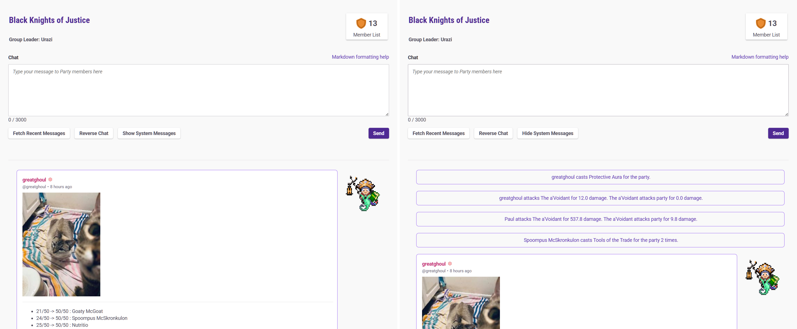

## Description

Toggle part system message visibility, hide by default.

## Screenshots

## Install

Make sure you have [Tamermonkey](https://chrome.google.com/webstore/detail/tampermonkey/dhdgffkkebhmkfjojejmpbldmpobfkfo) Chrome Extension or similar addon installed.

[INSTALL USERSCRIPT](https://github.com/greatghoul/habitica.user.js/raw/refs/heads/main/Hide_System_Messages/main.user.js)
 
